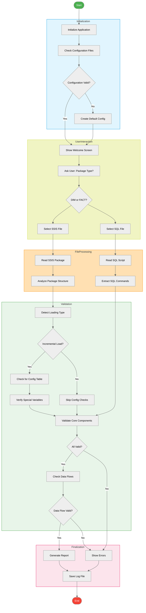

# SSIS Package Auto-Reviewer  

Automate compliance checks for SSIS packages against a customizable checklist. This tool validates `.dtsx` and `.sql` files, logs results, and enforces best practices for ETL workflows.  

---

## Features  
- **Automated Compliance Checks**  
- **Customizable Rules** via `property_rules.yml`  
- **Detailed Logs** for auditability  
---

## Installation  
1. **Clone the repository**:  
   ```bash
    https://github.com/PFarahani/ssis-package-auto-reviewer.git
   ```

2. **Install dependencies**:  
   ```bash
   pip install -r requirements.txt
   ```

3. **Compile the executable** (Windows):  
   ```bash
   pyinstaller --clean --onefile build.spec
   ```  
   The compiled `PackageAutoReviewer.exe` will be in the `dist/` folder.

---

## Usage  
1. **Run the `PackageAutoReviewer.exe` tool**  
   
2. **Review logs**:  
   Results are saved to `PackageAutoReview_<timestamp>.log`.

---

## Configuration  
Define validation rules in `property_rules.yml`:  
```yaml
# Example rule: check the `AlwaysUseDefaultCodePage` property value
oledb_source:
  AlwaysUseDefaultCodePage: 
    condition: 'equals'
    value: 'false'
```  

## Repository Structure

```
PackageAutoReview/
├── 📂config/
│   ├── __init__.py
│   ├── constants.py
│   └── property_rules.yml
├── 📂core/
│   ├── __init__.py
│   ├── processor.py
│   ├── validator.py
│   └── dataflow_analyzer.py
├── 📂utils/
│   ├── __init__.py
│   ├── file_io.py
│   ├── logging.py
│   └── helpers.py
├── 📂gui/
│   ├── __init__.py
|   ├── github_theme.py
│   └── file_dialog.py
├── 📂resources/
│   └── favicon.ico
└── main.py
```

## Execution Flowchart


