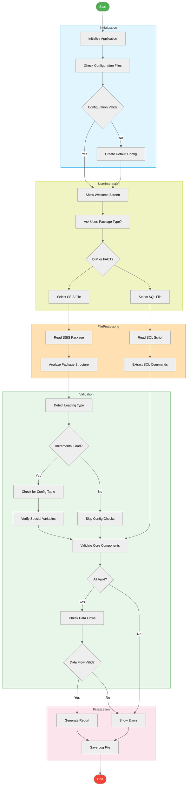

```mermaid
%%{init: {'theme': 'neutral', 'themeVariables': { 'fontSize': '12px'}}}%%

flowchart TD
    A([Start]) --> B[Initialize Application]
    B --> C[Check Configuration Files]
    C --> D{Configuration Valid?}
    D -- Yes --> E[Show Welcome Screen]
    D -- No --> CC[Create Default Config] --> E
    E --> F[Ask User: Package Type?]
    F --> G{DIM or FACT?}
    G --> H[Select SSIS File]
    G --> I[Select SQL File]
    H --> J[Read SSIS Package]
    I --> K[Read SQL Script]
    J --> L[Analyze Package Structure]
    K --> M[Extract SQL Commands]
    L --> N[Detect Loading Type]
    N --> O{Incremental Load?}
    O -- Yes --> P[Check for Config Table]
    O -- No --> Q[Skip Config Checks]
    P --> R[Verify Special Variables]
    Q --> S[Validate Core Components]
    R --> S
    M --> S
    S --> T{All Valid?}
    T -- Yes --> U[Check Data Flows]
    T -- No --> V[Show Errors]
    U --> W{Data Flow Valid?}
    W -- Yes --> X[Generate Report]
    W -- No --> V
    X --> Y[Save Log File]
    V --> Y
    Y --> Z([End])

    subgraph Initialization
        B
        C
        D
        CC
    end

    subgraph UserInteraction
        E
        F
        G
        H
        I
    end

    subgraph FileProcessing
        J
        K
        L
        M
    end

    subgraph Validation
        N
        O
        P
        Q
        R
        S
        T
        U
        W
    end

    subgraph Finalization
        X
        V
        Y
    end

    style A fill:#4CAF50,color:white
    style Z fill:#F44336,color:white
    style Initialization fill:#E1F5FE,stroke:#039BE5
    style UserInteraction fill:#F0F4C3,stroke:#CDDC39
    style FileProcessing fill:#FFE0B2,stroke:#FB8C00
    style Validation fill:#E8F5E9,stroke:#43A047
    style Finalization fill:#FCE4EC,stroke:#E91E63
```