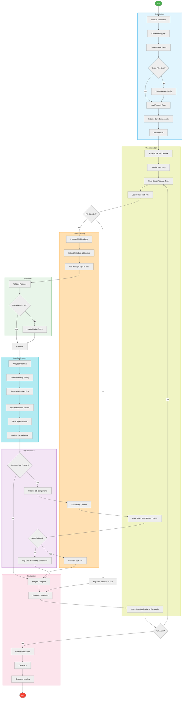

```mermaid
%%{init: {'theme': 'neutral', 'themeVariables': { 'fontSize': '12px'}}}%%

flowchart TD
    A([Start]) --> B[Initialize Application]
    B --> C[Configure Logging]
    C --> D[Ensure Config Exists]
    D --> E{Config Files Exist?}
    E -- No --> F[Create Default Config]
    E -- Yes --> G[Load Property Rules]
    F --> G
    G --> H[Initialize Core Components]
    H --> I[Initialize GUI]
    I --> J[Show GUI & Set Callback]
    J --> K[Wait for User Input]
    K --> L[User: Select Package Type]
    L --> M[User: Select SSIS File]
    M --> N{File Selected?}
    N -- No --> Z[Log Error & Return to GUI]
    N -- Yes --> O[Process SSIS Package]
    O --> P[Extract Metadata & Structure]
    P --> Q[Add Package Type to Data]
    Q --> R[Validate Package]
    R --> S{Validation Success?}
    S -- Yes --> T[Continue]
    S -- No --> U[Log Validation Errors]
    U --> T
    T --> V[Analyze Dataflows]
    V --> W[Sort Pipelines by Priority]
    W --> X[Stage DB Pipelines First]
    X --> Y[DW DB Pipelines Second]
    Y --> AA[Other Pipelines Last]
    AA --> AB[Analyze Each Pipeline]
    AB --> AC{Generate SQL Enabled?}
    AC -- No --> AH[Analysis Complete]
    AC -- Yes --> AD[Initialize DB Components]
    AD --> AE[Extract SQL Queries]
    AE --> AF[User: Select INSERT NULL Script]
    AF --> AG{Script Selected?}
    AG -- No --> AJ[Log Error & Skip SQL Generation]
    AG -- Yes --> AK[Generate SQL File]
    AK --> AH
    AJ --> AH
    AH --> AI[Enable Close Button]
    AI --> AL[User: Close Application or Run Again]
    AL --> AM{Run Again?}
    AM -- Yes --> L
    AM -- No --> AN[Cleanup Resources]
    AN --> AO[Close GUI]
    AO --> AP[Shutdown Logging]
    AP --> AQ([End])
    Z --> AI

    subgraph Initialization
        B
        C
        D
        E
        F
        G
        H
        I
    end

    subgraph UserInteraction
        J
        K
        L
        M
        AF
        AL
    end

    subgraph FileProcessing
        O
        P
        Q
        AE
        AK
    end

    subgraph Validation
        R
        S
        U
    end

    subgraph DataflowAnalysis
        V
        W
        X
        Y
        AA
        AB
    end

    subgraph SQLGeneration
        AC
        AD
        AG
        AJ
    end

    subgraph Finalization
        AH
        AI
        AN
        AO
        AP
    end

    style A fill:#4CAF50,color:white
    style AQ fill:#F44336,color:white
    style Initialization fill:#E1F5FE,stroke:#039BE5
    style UserInteraction fill:#F0F4C3,stroke:#CDDC39
    style FileProcessing fill:#FFE0B2,stroke:#FB8C00
    style Validation fill:#E8F5E9,stroke:#43A047
    style DataflowAnalysis fill:#B2EBF2,stroke:#00ACC1
    style SQLGeneration fill:#F3E5F5,stroke:#8E24AA
    style Finalization fill:#FCE4EC,stroke:#E91E63
```