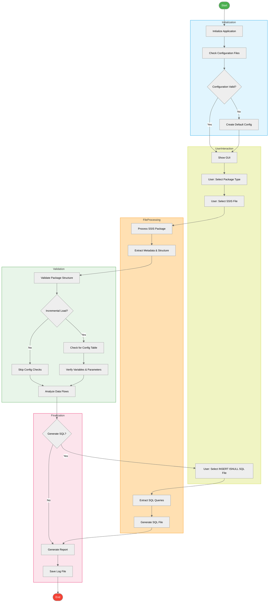

```mermaid
%%{init: {'theme': 'neutral', 'themeVariables': { 'fontSize': '12px'}}}%%

flowchart TD
    A([Start]) --> B[Initialize Application]
    B --> C[Check Configuration Files]
    C --> D{Configuration Valid?}
    D -- Yes --> E[Show GUI]
    D -- No --> CC[Create Default Config] --> E
    E --> F[User: Select Package Type]
    F --> G[User: Select SSIS File]
    G --> H[Process SSIS Package]
    H --> I[Extract Metadata & Structure]
    I --> J[Validate Package Structure]
    J --> K{Incremental Load?}
    K -- Yes --> L[Check for Config Table]
    K -- No --> M[Skip Config Checks]
    L --> N[Verify Variables & Parameters]
    M --> O[Analyze Data Flows]
    N --> O
    O --> P{Generate SQL?}
    P -- Yes --> Q[User: Select INSERT ISNULL SQL File]
    Q --> R[Extract SQL Queries]
    R --> S[Generate SQL File]
    P -- No --> T[Generate Report]
    S --> T
    T --> U[Save Log File]
    U --> V([End])

    subgraph Initialization
        B
        C
        D
        CC
    end

    subgraph UserInteraction
        E
        F
        G
        Q
    end

    subgraph FileProcessing
        H
        I
        R
        S
    end

    subgraph Validation
        J
        K
        L
        M
        N
        O
    end

    subgraph Finalization
        P
        T
        U
    end

    style A fill:#4CAF50,color:white
    style V fill:#F44336,color:white
    style Initialization fill:#E1F5FE,stroke:#039BE5
    style UserInteraction fill:#F0F4C3,stroke:#CDDC39
    style FileProcessing fill:#FFE0B2,stroke:#FB8C00
    style Validation fill:#E8F5E9,stroke:#43A047
    style Finalization fill:#FCE4EC,stroke:#E91E63
```